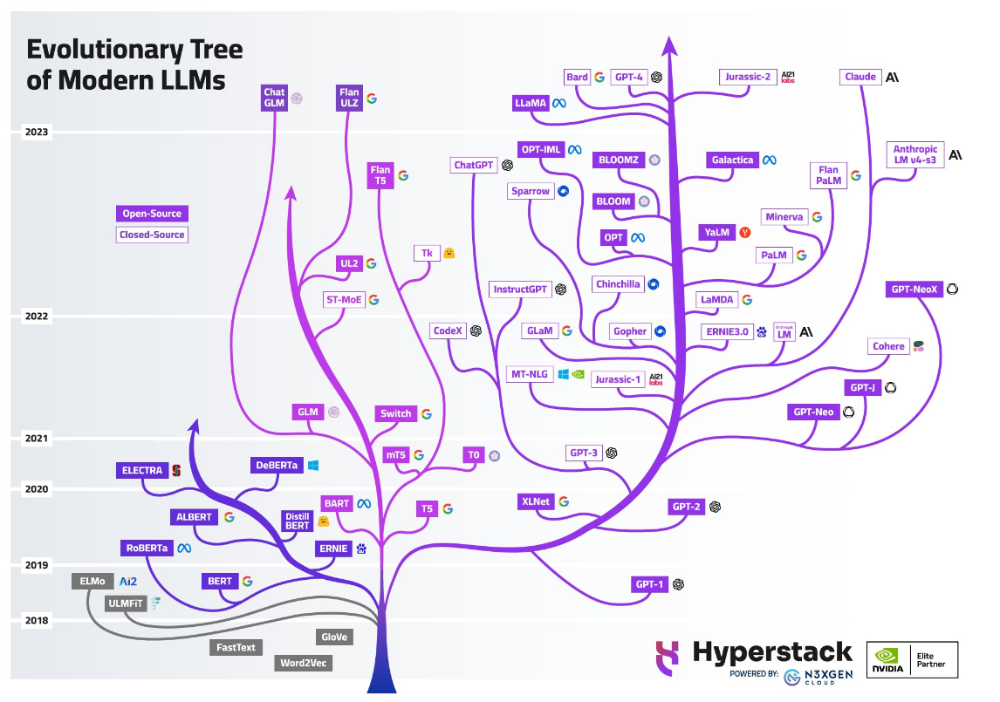

 
# Techniques for Graphics Generation

Lecture 1 - Basic prompts for text & code generations


## Ask you and LLM a question

```md
如果我的è—牙耳機壞了，去醫院è¦çœ‹ç‰™ç§‘還是耳鼻喉科？

If my Bluetooth earphones are broken, should I go 
to the dentist or the ENT (Ear, Nose, Throat) doctor?
```

For human, it seems like a weird question, but how LLM performs?

> References: COIG-CQIA: Quality is All You Need for Chinese Instruction Fine-tuning (2024)


### GPT 3.5 response 🤷â€â™€ï¸

If your Bluetooth earphones are broken, you should seek consultation from an ear, nose, and throat (ENT) specialist. Dentists primarily deal with teeth and oral health issues and do not have expertise in ear problems. An ENT specialist is specialized in treating issues related to the ears, nose, and throat, so they can help diagnose and treat problems related to Bluetooth earphones.

### GPT 4-o response 🙆â€â™‚ï¸

If your Bluetooth earphones are broken, it is a device issue and usually not related to medical conditions. If wearing earphones causes discomfort such as ear pain, ringing in the ears, or hearing loss, you should see an ear, nose, and throat specialist. If prolonged use of earphones causes discomfort in the jaw or teeth, you may consider seeing a dentist.

However, if it is just the earphones that are broken, it is recommended to address the device repair issue directly.

### COIG-CQIA: Quality is All You Need for Chinese Instruction Fine-tuning (2024)

Interesting findings and data from recent research. A chinese `Ruozhiba (弱智å§) (Stupid Forum)` dataset becomes the best chinese training prompt set for chineses LLM performances.

https://arxiv.org/html/2403.18058v1
https://huggingface.co/datasets/LooksJuicy/ruozhiba


## The Adoption of ChatGPT (2024)


> References: https://bfi.uchicago.edu/insights/the-adoption-of-chatgpt/


## Everyone use GPT models

We have use a lot LLM products in out daily life (CityU ChatGPT, Poe, OpenAI GPT)
But actually, why did the LLM will understand our input prompts?


## GPT Architecture Overview


> References: GPoeT-2: A GPT-2 Based Poem Generator


> References: References: FLUID-GPT Efficient Predictions of Particle Trajectories and Erosion

### Tokenization and Learning


> References: https://www.youtube.com/watch?app=desktop&v=V8qrVleGY5U

### Demo (LLM Visualization)

URL: https://bbycroft.net/llm

LLM learn from our data with mathematics patterns (Deep Learning)


> References: https://huyenchip.com/2023/05/02/rlhf.html


## Available LLM



https://artificialanalysis.ai/leaderboards/models


### Available LLM Playground

- Vercel AI
https://sdk.vercel.ai/playground

- Github Models (Beta)
https://github.com/marketplace/models

- Replicate 
https://replicate.com/explore

And more...


## Prompting can be a lot

- Zero-Shot  
- Few-Shot  
- Chain-of-Thought (CoT)  
- Prompt Chaining
- System prompt
- LoRA finetune
- Temperacture
- Model selection / self-hosting
- And more ...


**1. Zero-Shot**  
No samples, just ask the question

**2. Few-Shot**    
Providing few samples for references

**3. Chain-of-Thought (CoT)**   
Providing sets of Q&A for result

**4. Prompt Chaining**  
Base on previous prompting, ask another question


### 1. Zero-Shot prompting

No samples, just ask the question directly without any references or background explanations.

```md
Could you please help me generate a 450-word story about a three-year-old boy
going to school by bus?
```

```md
Why is the sky blue in color?
```


### 2. Few-Shot prompting

Provide a few samples for reference and follow the patterns.

```md
apple: fruit
orange: fruit
zucchini: vegetable
tomato:

Complete this list
```

Samples:

`Input`
```md
Follow the pattern and answer the questions

I go to school by bus // bus
The train is arriving // train
I have to buy a car for me // car
Please take me to a mini-bus //
```

`Output`
```md
Question: Please take me to a mini-bus.
Answer: mini-bus.
```


### 3. Chain-of-Thought (CoT)  

Without CoT for certain LLM model

```md
I baked 15 muffins. I ate 2 muffins and gave 5 muffins to a neighbor. 
My partner then bought 6 more muffins and ate 2. 
How many muffins do we now have?
```

```md
Result: 
The total number of muffins now is 21
# Wrong answer, it should be 12.
```

> https://huggingface.co/docs/transformers/tasks/prompting##reasoning


Nudges a model to produce intermediate reasoning steps thus improving the results on complex reasoning tasks.

```md
Let's go through this step-by-step:
1. You start with 15 muffins.
2. You eat 2 muffins, leaving you with 13 muffins.
3. You give 5 muffins to your neighbor, leaving you with 8 muffins.
4. Your partner buys 6 more muffins, bringing the total number of muffins to 14.
5. Your partner eats 2 muffins, leaving you with 12 muffins.
Therefore, you now have 12 muffins.
```

AKA LLM performs the `reasoning task` not very well; therefore, you need to provide step-by-step instructions to obtain the correct answers.


### 4. Prompt Chaining  

Base on previous prompting, ask another question.

Usage: 
- Chaining for Document QA
- Code changes for various features
- Asking questions for regarding content


### Prompting for code

Analysis the following prompt: (What elements are in this prompt?)

```md
You are a professional Python developer.
Help to write a calculator that computes a string list of student birthday lists
and outputs the actual age of each student.
Please follow the following coding format
and modify the code starting from the line “// Add codes belowâ€
and add comments to your output.
The code should be under 110 lines
and no other external pip library used.
Also please provide an input string list for the code.

"""
def calculates_student_ages(student_age_ls: list[string]) -> list[int]:
  // Add codes below
"""
```


### Prompting for code
We can split up this prompt into several aspects.

1. Role 
2. Actions and desire languages
3. Aims 
4. Input 
5. Output 
6. Feedback / comments 
7. Providing sufficient samples for few-shots promptings. 


## Prompting for code

#### 1. Role 
Who is LLM acting as? 
(e.g.Professional C++ coders? Junior developers? Or a python console?)

#### 2. Actions and desire languages 
What needs to be written, the target, and background?

#### 3. Aims 
What will be the final result?


#### 4. Input 
What input parameters are expected?
(e.g. input a salary number, a list of student names?)

#### 5. Output 
From format to output parameters
(e.g., a JSON format of student list, a total amount number, a CSV file written to OS?)


#### 6. Feedback / comments 
Providing specific requirements for LLM
(e.g., Adding comments to the code, running the produced code, code within 100 lines, using easily understandable syntax)

#### 7. Providing sufficient samples for few-shots promptings
(e.g., Providing JSON format samples, or giving a coding structure to fill in the blanks)


## Coding prompt study case 💻 

1. Professional Python developer
2. calculator that computes a string list of student birthday lists
3. outputs the actual age of each student.
4. `student_age_ls: list[string]`
5. `list[int]`
6. Under 110 lines and no other external pip library used. Also please provide an input string list for the code.
7. Please follow the following coding format 


Read the following prompt and guess whether it achieves the desired result.

### Prompts hk taxes calculator: (Chat-GPT 3.5)

```md
Act as a professional Python programmer.
Please write the code to generate Hong Kong taxes in 2022.
Please accept an input of my monthly salary,
and output the total amount of taxes that I need to pay in that year.
After writing it, execute the code and add comments on proper code sections.
```

### Prompt Checklist:

1. Languages: `Python`
2. Assist role: `Professional`
3. Target: `Tax cal`
4. Input: `My income`
5. Output: `Tax to pay`
6. Extra outcome: `Comments`

Result:

```python
def calculate_hong_kong_tax(monthly_salary):
    ## Calculate the annual salary
    annual_salary = monthly_salary * 12
    
    ## Define the tax brackets and corresponding rates
    tax_brackets = [50000, 100000, 150000, 200000]
    tax_rates = [0.02, 0.06, 0.10, 0.14, 0.17]
    
    ## Initialize tax amount to 0
    tax_amount = 0
    
    ## Calculate tax based on the progressive tax system
    if annual_salary <= tax_brackets[0]:
        tax_amount = annual_salary * tax_rates[0]
    elif annual_salary <= tax_brackets[1]:
        tax_amount = (tax_brackets[0] * tax_rates[0] +
                     (annual_salary - tax_brackets[0]) * tax_rates[1])
    elif annual_salary <= tax_brackets[2]:
        tax_amount = (tax_brackets[0] * tax_rates[0] +
                     (tax_brackets[1] - tax_brackets[0]) * tax_rates[1] +
                     (annual_salary - tax_brackets[1]) * tax_rates[2])
    elif annual_salary <= tax_brackets[3]:
        tax_amount = (tax_brackets[0] * tax_rates[0] +
                     (tax_brackets[1] - tax_brackets[0]) * tax_rates[1] +
                     (tax_brackets[2] - tax_brackets[1]) * tax_rates[2] +
                     (annual_salary - tax_brackets[2]) * tax_rates[3])
    else:
        tax_amount = (tax_brackets[0] * tax_rates[0] +
                     (tax_brackets[1] - tax_brackets[0]) * tax_rates[1] +
                     (tax_brackets[2] - tax_brackets[1]) * tax_rates[2] +
                     (tax_brackets[3] - tax_brackets[2]) * tax_rates[3] +
                     (annual_salary - tax_brackets[3]) * tax_rates[4])
    
    return tax_amount

## Example usage:
monthly_salary = 30000  ## Input: Monthly salary
tax_amount = calculate_hong_kong_tax(monthly_salary)
tax_amount
```


Python Result from 30,000 hkd / m

```python
print(calculate_hong_kong_tax(30000))
## 43200.0
```

= `43200.0 HKD`

Actual result = `20760.00 HKD`

> What’s wrong with the prompt?


Can you spot the missing factors?

```md
Act as a professional Python programmer.
Please write the code to generate Hong Kong taxes in 2022.
Please accept an input of my monthly salary,
and output the total amount of taxes that I need to pay in that year.
After writing it, execute the code
and add comments on proper code sections.
```

What factor is missing in the prompt? 
If you familiar with the taxes system, then you may spot it.


Act as a professional Python programmer. Please write the code to generate Hong Kong taxes in 2022 for `single person with tax exemption`. Please accept an input of my monthly salary, and output the total amount of taxes that I need to pay in that year. After writing it, execute the code and add comments on proper code sections.


- What factor is missing?
**Missing Tax exemption calculations**

- The details are not sufficient to generate the proper code.
**You need to provide full details for your prompts** 


```python
def calculate_hong_kong_tax_with_exemption(monthly_salary):
    ## Calculate the annual salary
    annual_salary = monthly_salary * 12
    
    ## Subtract the basic allowance for a single person
    taxable_income = max(0, annual_salary - 132000)
    
    ## Define the tax brackets and corresponding rates
    tax_brackets = [50000, 100000, 150000, 200000]
    tax_rates = [0.02, 0.06, 0.10, 0.14, 0.17]
    
    ## Initialize tax amount to 0
    tax_amount = 0
    
    ## Calculate tax based on the progressive tax system
    if taxable_income <= tax_brackets[0]:
        tax_amount = taxable_income * tax_rates[0]
    elif taxable_income <= tax_brackets[1]:
        tax_amount = (tax_brackets[0] * tax_rates[0] +
                     (taxable_income - tax_brackets[0]) * tax_rates[1])
    elif taxable_income <= tax_brackets[2]:
        tax_amount = (tax_brackets[0] * tax_rates[0] +
                     (tax_brackets[1] - tax_brackets[0]) * tax_rates[1] +
                     (taxable_income - tax_brackets[1]) * tax_rates[2])
    elif taxable_income <= tax_brackets[3]:
        tax_amount = (tax_brackets[0] * tax_rates[0] +
                     (tax_brackets[1] - tax_brackets[0]) * tax_rates[1] +
                     (tax_brackets[2] - tax_brackets[1]) * tax_rates[2] +
                     (taxable_income - tax_brackets[2]) * tax_rates[3])
    else:
        tax_amount = (tax_brackets[0] * tax_rates[0] +
                     (tax_brackets[1] - tax_brackets[0]) * tax_rates[1] +
                     (tax_brackets[2] - tax_brackets[1]) * tax_rates[2] +
                     (tax_brackets[3] - tax_brackets[2]) * tax_rates[3] +
                     (taxable_income - tax_brackets[3]) * tax_rates[4])
    
    return tax_amount

## Example usage:
monthly_salary = 30000  ## Input: Monthly salary
tax_amount = calculate_hong_kong_tax_with_exemption(monthly_salary)
tax_amount
```


### Correct Result

Python Result from 30,000 hkd / m

```python
print(calculate_hong_kong_tax(30000))
## 20760.0
```

= 20760.0 HKD

Actual result = 20760.00 HKD
Now the code is correct!


## System prompt / Instructions

> Static context description refers to providing fixed information to the LLM. This information can include content and format instructions, database schema information, or any other contextual information that is relevant to the task.

https://learn.microsoft.com/en-us/ai/playbook/technology-guidance/generative-ai/working-with-llms/prompt-engineering

AKA a pre-prompting stage for controlling the user prompt result.


### Create system prompt bot in `PoE`


> https://poe.com/create_bot


> For certain university GPT bot that subscribe to `Azure AI` or other direct `OpenAI services`, they will provide the options to setup your assist prompt.

> Learn more: https://learn.microsoft.com/en-us/azure/ai-services/openai/how-to/chatgpt?tabs=python-new


### System prompt in coding level

Let's use `Python` as an example. The system prompt can be pre-defined to support user requirements.

```python
from dotenv import dotenv_values
import openai

openai.api_key = dotenv_values(".env")["OPEN_AI_APIKEY"]

def gptGen():
    result = openai.ChatCompletion.create(
        model="gpt-3.5-turbo",
        messages=[
            { "role": "system", "content": "You are a technology media content creator KOL."},
            { "role": "user", "content": "Help to make a instagram post."},
        ]
    )
    print(result.choices[0].message.content)
```


### System prompt examples

> Math teacher https://arxiv.org/pdf/2310.13712
```md
“You are a professional K12 math teacher helping students answer math questions.

Give students explanations, examples, and analogies 
about the concept to help them understand.
You should guide students in an open-ended way.
Make the answer as precise and succinct as possible.
```

>Engaging in a casual conversation
```md
Let's have a friendly chat about your favorite hobbies.
```

> English Grammar fixer
```md
You are an english assistant that helps to
adjust grammer mistake and enhance the english paragraph.
Please help to fix all the user input english paragraph.
```


### Advices for prompting

1. Start with a simple and short prompt, and iterate from there.
2. Avoid ambiguous descriptions and instructions.
3. Favor instructions that say “what to do†instead of those that say “what not to doâ€.
4. Be specific and descriptive about the task and the desired outcome - its format, length, style, language, etc.

> https://huggingface.co/docs/transformers/tasks/prompting##best-practices-of-llm-prompting


### Recommendation for students
(Computer Science Tasks)

Instead of attempting to generate complete code, students can employ LLMs to generate code explanations, learn new frameworks and concepts, and suggest possible enhancements to the code. LLMs can also generate sample test cases, and help to clarify any doubt about a potential solution.

> Ref: https://arxiv.org/pdf/2402.01687


## Extra

Can I use prompt to write prompt?
Actually, you can.

As measured by the interquartile mean across the 24 NLP tasks introduced by Honovich et al. (2022), APE is able to surpass human performance when using the InstructGPT model. 

> More about InstructGPT
https://openai.com/index/instruction-following/


### Learn more

- Prompt Engineering Guide
https://www.promptingguide.ai/ 
- Learn Prompting
https://learnprompting.org/docs/introduction 
- Claude Docs
https://docs.anthropic.com/en/docs/build-with-claude/define-success 
- Azure ai-services
https://learn.microsoft.com/en-us/azure/ai-services/openai/concepts/advanced-prompt-engineering?pivots=programming-language-chat-completions
- Openai
https://community.openai.com/t/the-art-of-ai-prompt-crafting-a-comprehensive-guide-for-enthusiasts/495144


### Play more (Free resources)

- Hugging Face
https://huggingface.co/models

- Poe
https://poe.com/

- Replicate
https://replicate.com/


### References

1. https://concord.org/newsletter/2012-fall/under-the-hood/
https://techcrunch.com/2010/03/11/opengl-4-0-comes-out-to-play/
2. https://www.researchgate.net/figure/Comparison-of-general-graphics-and-WebGL-graphics-processing-approaches_fig1_320511384
3. https://civitai.com/images/22874510
4. https://lumaai.notion.site/FAQ-and-Prompt-Guide-Luma-Dream-Machine-9e4ec319320a49bc832b6708e4ae7c46##93b5b6d2ca304693987c75831a05709f

