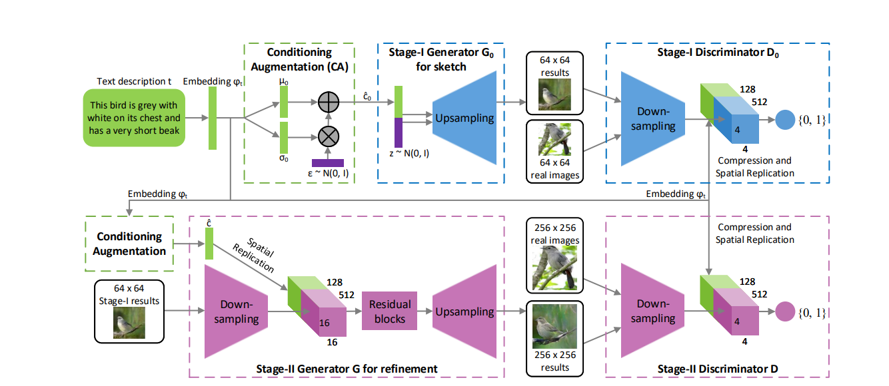
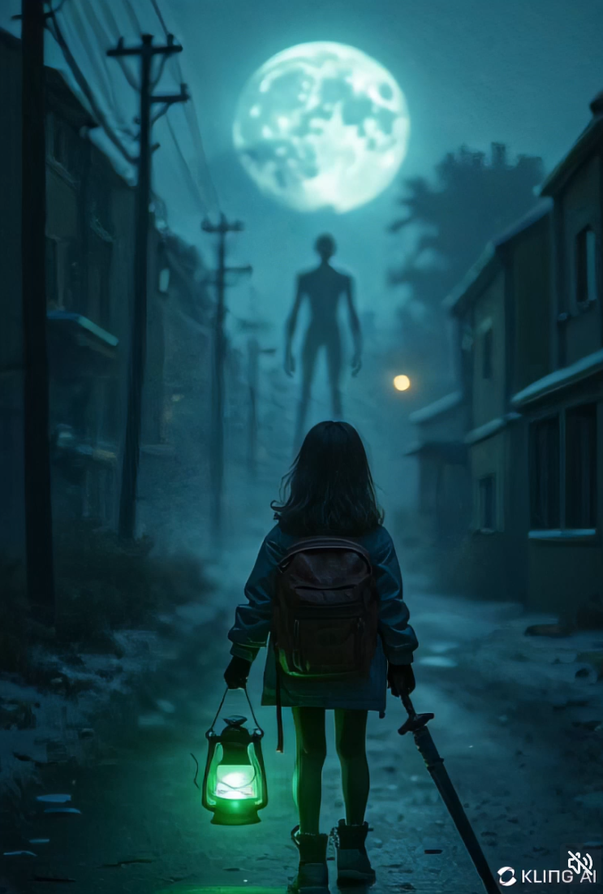

sidebarTitle: Lecture 02

 
# Techniques for Graphics Generation

Students through Innovative Techniques for Graphics Generation

Lecture 2 - Advance prompting in computer vision & video

## Generative Adversarial Networks (GAN)

The fundamental concepts of how your prompts will be translated into images.

> GAN utilizes multiplicative integration that allows flexible region-based modulation, and can thus be seen as a generalization of the successful StyleGAN network.

https://github.com/dorarad/gansformer

### What happens in GAN

Several key words that you have to know:

- `Noise`: A math generated `random` noice images.

- `Generator (CNN)` : Generate images by input `Noise`, and output the `images`
`Convolutional neural network (CNN)`

- `Discriminator (DNN)`: Try to identify `Generator` images whether it s similar to the real image.
`Deconvolutional Neural Network (DNN)`

> StackGAN: Text to Photo-realistic https://arxiv.org/pdf/1612.03242

In the early stages, the generated image will appear as noise

### GAN process

In brief, the GAN process reconstructs noise into meaningful images using deep learning methods.

e.g. 
- `Convolutions Networking (CNN and DNN)`
- `Transformer in vision (VIT)`
- `Feed forward Dense`

### Forward to 2022 / 2023
SDXL: Improving Latent Diffusion Models for High-Resolution Image Synthesis
A latent diffusion model for text-to-image synthesis. Which implemented text-encoder to allow models to generate text related `noise` for reconstruct prompt related images.

- `SD`: Stable Diffusion
- `SDXL`: Stable Diffusion XL

> https://arxiv.org/pdf/2307.01952

## Latent Space

> lower-dimensional space that captures the essential features of the input data.

In the `QKV` structure, the latent space of the visual aspect refers to specific features or characteristics, somewhat similar to the `PCA` method.

You can establish the relationship between text and images through various aspects such as color, location, object, action, and more.

## Text to images

### MMDiT

Conceptual visualization of a block of our modified multimodal diffusion transformer: MMDiT

which employs your input text for `QKV` learning in the transformer to understand the relationship features between `images` and `text`.

### System Implications of Multi-Modal Generation

> https://arxiv.org/pdf/2312.14385

1. Your `prompt` will be processed with a `text-encoder` to generate `noise images`.
2. The `noise` image will be reconstructed into real images using the SD models multiple times with a `Denoising U-Net`, which consists of an `encoder` and `decoder` network similar to `GAN`.
3. The `Latent Space` stores all the text and image features, helping the models generate relevant `noise` based on input prompts.
4. The `SD models` are pretrained on numerous labeled images with prompts, enabling them to understand the relationship between text and image noise features.

## Stable diffusion noise visualization Demo

- Learn how Stable Diffusion transformsyour text prompt into image
https://poloclub.github.io/diffusion-explainer/
https://arxiv.org/pdf/2305.03509

- How does Stable Diffusion work?
https://stable-diffusion-art.com/how-stable-diffusion-work/

## Terms for Config

Understanding these fundamental terms will help you grasp the basics of `text-to-media`, even though some syntax or tools may become deprecated or unsuitable for your final assignment with selected tools.

### Generation configs 

- `CFG scale (guidance scale)`:  
Means `Temperacture`, higher value means to more precise to your prompt.
(You can imagine it to "creativity" control)

- `Sampler`:  
The `method` to generate the `noise` image. Refer to your selected models.

- `Steps (Epoch)`:  
How many steps will the generate process to the `noise` image, please refer to `page 10` epoch.

- `Seed`:  
The random fixed number for you to obtain the same result. 

- `CLIP Skip`:  
Constative Language-Image Pre-training, used to transfer your prompt into noise vector.
`CLIP Skip` provides the possibility to skip several `text-encoding` layers, to prevent `overfitting` in `SD`.
(AKA: How accurate you want the text model to be)

- `Prompt`:  
Your input prompt, to generate the desire images / video

- `Negative Prompt`:  
Your input negative prompt, to prevent the model to generate these unwanted items. (e.g. Bad hands, NSFW, two heads...)

- `Embaddings`:  
A preset of `Prompt`, means a scripted text embaddings for specific prompt text. Can be scripted to `Negative prompt` or `Positive prompt`

### Token Weighting: `Prompt Emphasis` 
- Increases attention: `( )` , `(( ))`, `(token:n.n)`
- Decreases attention: `[]`, `[[ ]]`

Which helps to scale the affect power the target prompt text.

e.g. `boy, (big head: 1.5), sunny day`
The affect of `big head` will be scale to 1.5 in this prompt.

### `lora`
Low-Rank Adaptation (LoRA) is a technique used to add parameters and incorporate unseen fine-tuning data into existing models.

LORA Applications: 

- Allow an `SD model` to generate an unseen character (e.g., Eren Yeager).
- Add various `styles` to generated models (e.g., hand drawings, cartoon style).
- Enhance models by adding `details` or making `adjustments`.

## Prompting in vision / video aspects

Here are 5 points of prompting to vision aspects.

1. `camera`
2. `environment`
3. `objective` 
4. `animations` 
5. `effects`

Which can be intergrated into `style` / `medium` / `color & lighting` / `composition`

> !! Those are just suggested aspects, not a strict rule. !!

### 1. Providing camera aspects

1. Camera starting point
2. Angles
3. Zoom
4. Lens using
5. Brand
6. ISO
7. Frame
8. Director style

#### 1. Camera starting point
low to the ground, upward angle, eye level

#### 2. Angles
dynamic angles, wide overhead shot, intimate close-up, 45-degree angle

#### 3. Zoom
slow zoom-in, tightening focus, subtle emotions

#### 4. Lens using
wide-angle lens, expansive landscape, close foreground action

#### 5. Brand
Canon EOS R5, crispness, dynamic range, shadow and light details

#### 6. ISO
low light, ISO 3200, moody, atmospheric, grain, noise

#### 7. Frame
rule of thirds, balanced, visually appealing

#### 8. Director style
Quentin Tarantino, long takes, steady camera movements, quick cuts, tension, urgency

### 2. Providing environment aspects

1. Place
2. Weather
3. Other objects
4. Buildings
5. Time background
6. Specific target

#### 1. Place
urban setting, forest, beach, mountaintop

#### 2. Weather
overcast, rainy, sunny, foggy, stormy

#### 3. Other objects
vehicles, trees, animals, furniture, props

#### 4. Buildings
skyscrapers, cottages, warehouses, historic landmarks

#### 5. Time background
dusk, dawn, midday, midnight, golden hour

#### 6. Specific target
protagonist, vehicle, object, landscape, crowd

### 3. Providing objective aspects

1. Your main character
2. Styling
3. Equipment
4. Face express
5. Hand and legs movement
6. Eyes sight
7. Feelings
8. Looking at

#### 1. Your main character
hero, villain, child, elder, stranger, boy

#### 2. Styling
casual, formal, rugged, vintage, futuristic

#### 3. Equipment
weapon, tool, accessory, gadget, prop

#### 4. Face express
smile, frown, grimace, surprise, determination

#### 5. Hand and legs movement
slow walk, sprint, gesture, fidget, stance

#### 6. Eyes sight
direct gaze, side glance, downward look, scanning, focused

#### 7. Feelings
joy, fear, anger, sadness, confusion

#### 8. Looking at
another character, distant object, mirror, camera, horizon

### 3.1 Prompting a character

1. Gender (Boy / Girl / Others)
2. Class
3. Face
4. Head / Hair
5. Wearings
6. Hand / Arms/ Legs position
7. Pose
8. Styles
9. References

#### 1. Gender
boy, girl, non-binary, androgynous

#### 2. Class
upper class, middle class, working class, royalty, street

#### 3. Face
sharp features, soft features, round face, angular, expressive

#### 4. Head / Hair
short hair, long hair, messy, styled, hat, headpiece

#### 5. Wearings
suit, dress, casual clothes, uniform, accessories

#### 6. Hand / Arms/ Legs position
crossed arms, hands in pockets, outstretched arms, standing, sitting, bent knees

#### 7. Pose
confident, relaxed, tense, dynamic, casual

#### 8. Styles
modern, vintage, futuristic, bohemian, minimalist, Japanese comics, Pixar Animation, Kyoto Animation, Lascaux

#### 9. References
fashion magazines, movie characters, historical figures, cultural icons, art styles

### 4. Providing animations aspects

1. What is moving in the sence? 
2. How the main / sub character moving. 
3. Any stars / magic / fog / object happening around the camers? 
4. Is there any transforming happens?

#### 1. What is moving in the sence?
vehicle, leaves, water, animals, shadows

#### 2. How the main / sub character moving. 
walking, running, floating, dancing, crawling

#### 3. Any happening around the camers? 
sparkles, mist, fireflies, glowing light, floating debris

#### 4. Is There Any Transforming Happening?
shape-shifting, morphing, growing, shrinking, merging

### 5. Providing effects aspects (For video)

1. How the camera behave?
2. Following the main character?
3. Fixed camer?
4. Zoom in to out?
5. High angle?
6. Two different cameras?

#### 1. How the camera behave
panning, tracking, tilting, steady, handheld

#### 2. Following the main character
tracking shot, over-the-shoulder, side-by-side, circling

#### 3. Fixed camer
stationary, locked-off, tripod-mounted, stable frame

#### 4. Zoom in to out?
dolly zoom, gradual zoom out, fast zoom in, reverse zoom

#### 5. High angle?
bird's-eye view, top-down shot, overhead, downward angle

#### 6. Two different cameras?
dual perspective, split-screen, cross-cutting, alternating angle

## Images / Graph promptings 🛕

Guess what prompt text is used?
- White Moon?
- Girl holding lantern and sword?
- Night street in USA?
- Walking to a huge giant?
- Green light?
- Camera center?
- Slowly towards?
- And more?

>  Ref: https://civitai.com/images/22874510

Atmospheric slow-motion video of a desolate cityscape, capturing the girl with a backpack,
magic green lantern, and toy sword.
The camera pans from a darkened street toward the haunting silhouette of Slenderman on the horizon.
Dim moonlight filters through clouds,
enhancing a chilling, suspenseful ambiance, evoking fear and wonder.

### Let’s break down the prompts 🚖

Camera motion:
- Atmospheric slow-motion video of a desolate cityscape

Camera Actions:
- capturing the girl with a backpack, magic green lantern, and toy sword. 

Object features:
- girl with a backpack, magic green lantern, and toy sword.

Atmosphere and camera motion describe:
- The camera pans from a darkened street toward the haunting silhouette of Slenderman on the horizon.

Setting background and place describe:
- Dim moonlight filters through clouds, enhancing a chilling, suspenseful ambiance, evoking fear and wonder.

Just for the reference to this text-to-video, you may adjust or remove the necessary parts in order to fullfill your requirement.

## Images / Graph example 🌄

-movie stills of bladerunner 2049, skyscrapers advertisements on buildings tv, sci-fi film, Dynamic pose, photograph taken by Michael Bay on a CANON EOS C500 MARK II, f/22, Shutter Speed 1/ 1000, ISO 1000, 55mm lens, low lighting, cinematic scene, fx, HDR, epic composition, cinematic photo, hyper - realistic, hyper - detailed, cinematic lighting, particle effects, action photography, hyper realistic, 8k resolution, unreal engine, photorealistic masterpiece, smooth, real photography, full hd, Megapixel, Pro Photo RGB, VR, Good, Massive, Half rear Lighting, Backlight, Incandescent, Optical Fiber, Moody Lighting, Studio Lighting, Soft Lighting, Volumetric, Conte - Jour, Beautiful Lighting, Accent Lighting, Screen, Ray Tracing Global Illumination, Optics, Scattering, Glowing, Shadows, Rough, Shimmering, Ray Tracing Reflections, Lumen Reflections, Screen Space Reflections, Diffraction Grading, Chromatic Aberration, GB Displacement, Scan Lines, Ray Traced, Ray Tracing Ambient Occlusi on, Anti - Aliasing, FKAA, TXAA, RTX, SSAO, Shaders, OpenGL - Shaders, GLSL - Shaders, Post Processing...

### Let’s break down the prompts 🌄

Camera style:
- photograph taken by Michael Bay on a CANON EOS C500 MARK II, f/22, Shutter Speed 1/ 1000, ISO 1000, 55mm lens, low lighting, cinematic scene, fx, HDR, epic composition, cinematic photo, hyper - realistic, hyper - detailed, cinematic lighting, particle effects, action photography, hyper realistic, 8k resolution, unreal engine, photorealistic masterpiece, smooth, real photography, full hd, Megapixel, Pro Photo RGB, VR, Good, Massive

Atmosphere:
- movie stills of bladerunner 2049, skyscrapers advertisements on buildings

Light describe:
- Beautiful Lighting, Accent Lighting, Screen, Ray Tracing Global Illumination, Optics, Scattering, Glowing, Shadows, Rough, Shimmering, Ray Tracing Reflections, Lumen Reflections, Screen Space Reflections, Diffraction Grading, Chromatic Aberration, GB Displacement, Scan Lines, Ray Traced, Ray Tracing Ambient Occlusi 

Process describe:
- Anti - Aliasing, FKAA, TXAA, RTX, SSAO, Shaders, OpenGL - Shaders, GLSL - Shaders, Post Processing, Post - Production, Cell Shading, Tone Mapping, CGI, VFX, SFX

1. These `text-to-media` structure is just a recommended format, does not mean you have to strictly follow these rules and method. Sometime, let the models create their own style are also a good references.

2. Try to view more creations from other to see how to construct the wordings.

## Extra 

### GPT to video / image prompt

Q. Can I tell GPT to generate video / images prompt?
A. Yes, you can turn a systme prompt to tell the GPT for it.

- SDPromptGenerator
https://github.com/techvishnu/SDPromptGenerator

### CLIP Interrogator

Q. Can I reverse the prompt text form images? 
A. Yes, the technology of `CLIP Interrogator` can reverse the image-to-prompt.

- Demo:
https://huggingface.co/spaces/pharmapsychotic/CLIP-Interrogator

- Interesting paper (Image Captioners Sometimes Tell More Than Images They See)
https://arxiv.org/pdf/2305.02932

### Stable Diffusion web UI

Q. Can I self-host the Stable Diffusion models by my own?
A. Yes, you can create / modify / host your own text-to-images / text-to-video with proper software.

- AUTOMATIC1111 SD webui
https://github.com/AUTOMATIC1111/stable-diffusion-webui

- ComfyUI
https://github.com/comfyanonymous/ComfyUI

### Try more applications

- viggle
https://viggle.ai/home

- tripo3d
https://www.tripo3d.ai/

- vidnoz
https://www.vidnoz.com/

- leonardo
https://app.leonardo.ai/
