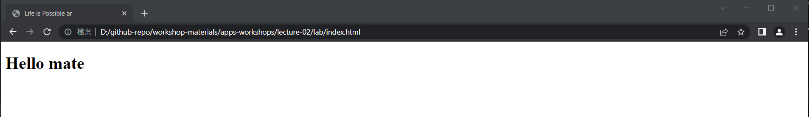
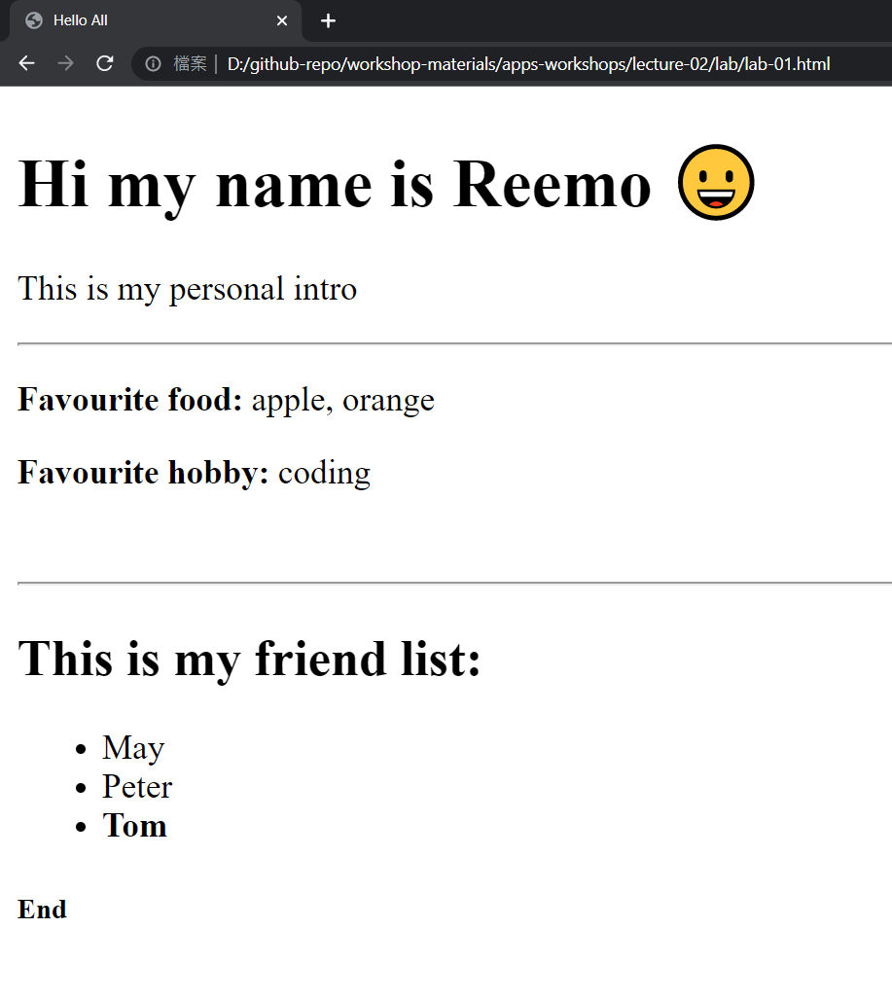

# Life is Possible - 生命教育 手機程式工作坊

講課 02 - 基本的HTML架構

---

# 選單
- HTML的定義和作用
- HTML的概念
- 基本的HTML架構
- 閱讀標籤和文件

---

# 什麼是HTML，為什麼要使用它?


---


---

# 如何建立網站？

## Python? C++? Ruby? Java?

---

# HTML


---

# HTML (Hyper Text Markup Language)
(超文字標記語言)

簡而言之：

- HTML是創建網頁的標準標記語言
- HTML描述了網頁的結構
- HTML由一系列元素組成
- HTML元素告訴瀏覽器如何顯示內容
- HTML元素標記內容的不同部分，例如“這是標題”、“這是段落”、“這是鏈接”等等。

---

# HTML的優點

- ✨ 容易學習
- 💻 每個瀏覽器都支持HTML語言（跨平台）
- ⚡ HTML是輕量級(Lightweight)的，加載速度快
- 等等 ...

---

# 基本結構

`index.html`
```html
<!DOCTYPE html>
<html lang="en">
<head>
    <meta charset="UTF-8">
    <meta http-equiv="X-UA-Compatible" content="IE=edge">
    <meta name="viewport" content="width=device-width, initial-scale=1.0">
    <title>Life is Possible ar</title>
</head>
<body>
    <!-- All stuff here -->
    <h1> Hello mate </h1>
</body>
</html>
```

---

# 簡單結構

`index.html`
```html
<!DOCTYPE html>
<html lang="en">
  <head>
      <!-- All Style / CSS / Headerstuff here -->
      <!-- To define meta tags, css file, title is here -->
  </head>
  <body>
      <!-- All HTML / JS stuff here -->
      <!-- To define visible stuff and JS script here -->
  </body>
</html>
```

---

# 🏷 基本標籤
這些標籤是很重要的基礎知識

---

# `<html> </html>`
https://developer.mozilla.org/en-US/docs/Web/HTML/Element/html

> `<html>` 元素代表HTML文檔的根（頂級元素），因此也被稱為根元素。所有其他元素都必須是此元素的子孫元素。

也就是說，告訴電腦這個文件是一個HTML文件。

---

# `<head> </head>`
https://developer.mozilla.org/en-US/docs/Web/HTML/Element/head

> `<head>`元素包含有關文檔的機器可讀信息（元數據），例如其標題，腳本和樣式表。

也就是說，告訴電腦這些項目是標題，腳本和樣式表。

---

# `<body> </body>`
https://developer.mozilla.org/en-US/docs/Web/HTML/Element/body

> `<body>` HTML 元素表示 HTML 文檔的內容。一個文檔中只能有一個 `<body>` 元素。

也就是說，告訴電腦這些在這些標籤之間的部分是 HTML 文檔的內容。


---

`index.html`
```html
<!DOCTYPE html>
<html lang="en">
<head>
    <meta charset="UTF-8">
    <meta http-equiv="X-UA-Compatible" content="IE=edge">
    <meta name="viewport" content="width=device-width, initial-scale=1.0">
    <title>Life is Possible ar</title>
</head>
<body>
    <!-- All stuff here -->
    <h1> Hello mate </h1>
</body>
</html>
```

---
# 成品



---

# 注意事項
1. 有些標籤是成對出現的，但有些標籤不是。
例如：（成對出現：`<body>...</body>`，單獨出現：`<meta>`）

請查閱文件和教程以檢查其使用方法。

---

# 休息

---

# 基本標籤

---

# 🏷 body 標籤 (與容器相關)

### `<div>` : 基本框盒標籤

<hr>

### `<header>` : 儲存網頁**頁首**內容
### `<section>` : 儲存**各個區域**的內容
### `<footer>` : 儲存網頁**頁尾**內容

---

# 規則 1
### 通常 HTML 標籤是成對出現的
```html
   開始標籤    結束標籤
    <div>      </div>
```

```html
<div>some stuff inside the box</div>
<header>some stuff inside the box</header>
<footer>some stuff inside the box</footer>
```

---

# 規則 2
### 標籤可以互相嵌套，只要語法正確即可

```html
<div>

  <div>hello</div>

  <div>
    <div>hello</div>
    <div>yolo</div>
  </div>

</div>
```

---


---


Ref: https://www.interviewbit.com/blog/difference-between-html-and-css/

---

```html
<!DOCTYPE html>
<html lang="en">
<head>
    <meta charset="UTF-8">
    <meta http-equiv="X-UA-Compatible" content="IE=edge">
    <meta name="viewport" content="width=device-width, initial-scale=1.0">
    <title>Hi all</title>
</head>
<body>

    <header>Hello all</header>

    <div>
        <h1>Hello</h1>
    </div>

    <footer>Bye</footer>

</body>
</html>
```

---

# 主要常用的標籤

* `<h1>–<h6>`: 標題文字標籤，用於包含文字。
https://developer.mozilla.org/en-US/docs/Web/HTML/Element/Heading_Elements

* `<p>`: 段落元素。
https://developer.mozilla.org/en-US/docs/Web/HTML/Element/p

* `<span>`: 通用的內嵌容器。
https://developer.mozilla.org/en-US/docs/Web/HTML/Element/span

* `<br>`:  斷行元素。
https://developer.mozilla.org/en-US/docs/Web/HTML/Element/br

* `<b>`: 強調元素。
https://developer.mozilla.org/en-US/docs/Web/HTML/Element/b

---

```html
<!DOCTYPE html>
<html lang="en">
<head>
    <meta charset="UTF-8">
    <meta http-equiv="X-UA-Compatible" content="IE=edge">
    <meta name="viewport" content="width=device-width, initial-scale=1.0">
    <title>Hi all</title>
</head>
<body>

    <h1>Hello</h1>
    <h2>Hello 2</h2>
    <h3>Hello 3</h3>

    <br>

    <p>Yoooo</p>
    <span>Apple</span>
    <b>I am strong</b>

</body>
</html>
```

---

# 主要常用的標籤

* ``: 圖片嵌入元素。
https://developer.mozilla.org/en-US/docs/Web/HTML/Element/img

* `<hr>`: 分隔線 (水平線) 元素。
https://developer.mozilla.org/en-US/docs/Web/HTML/Element/hr

* `<a>`: 錨點元素。
https://developer.mozilla.org/en-US/docs/Web/HTML/Element/a

---

```html
<!DOCTYPE html>
<html lang="en">
<head>
    <meta charset="UTF-8">
    <meta http-equiv="X-UA-Compatible" content="IE=edge">
    <meta name="viewport" content="width=device-width, initial-scale=1.0">
    <title>Hi all</title>
</head>
<body>

  <a href="https://youtu.be/dQw4w9WgXcQ"> Funny youtube video </a>

  <hr>

  

</body>
</html>
```

---

# 主要常用的標籤

* `<ul>`, `<ol>`, `<li>`: 無序清單、有序清單和清單項目。
https://developer.mozilla.org/en-US/docs/Web/HTML/Element/ul
https://developer.mozilla.org/en-US/docs/Web/HTML/Element/ol
https://developer.mozilla.org/en-US/docs/Web/HTML/Element/li

---

# 主要常用的標籤 (功能性)
稍後會在 JS 課程中進一步介紹。

* `<button>`
* `<form>`
* `<input>`
* `<option>`

---

# 主要常用的標籤
查看此處以了解我們可以在 HTML 中使用什麼：
https://developer.mozilla.org/en-US/docs/Web/HTML/Reference

#### ‼ 記住：搜尋 Google 和文件是編碼的關鍵。 ‼

---

# 休息時間

---

# Lab 01 - 嘗試複製網站
嘗試使用 html 代碼編寫相關圖像。

<br>

註： 😀 是一個表情符號。



---

# Lab 02 - 自我介紹
使用以下模板，嘗試用 HTML 頁面介紹自己。
(中英文都可以)

```html
<!DOCTYPE html>
<html lang="en">
<head>
    <meta charset="UTF-8">
    <meta http-equiv="X-UA-Compatible" content="IE=edge">
    <meta name="viewport" content="width=device-width, initial-scale=1.0">
    <title>Peter homepages</title>
</head>
<body>
  <!-- Your content -->
</body>
</html>
```

--- 

# Lab 02 - 自我介紹（續）
你的網頁**應包含Must**以下內容：
- 📃 名字和簡短介紹
- 📚 分享4個喜愛的事物，3個朋友的名字等等
- ✏ 適當的佈局和UI設計

你也**可以包含Should**以下內容：
- ✨ 其他你能想到的內容...

--- 

# Lab 02 - 自我介紹（續）
完成後，你會有30-60秒的時間向其他人展示你的網站。將`site.html`重新命名為 `<your-name>_l01_lab02.html`，例如 `peter_l01_lab02.html` 。

你可以將網站提交到以下google表格中：
（連結將在課堂時間分享）

---

# 結束

---

# 額外閱讀 (English)

- w3school HTML教程
https://www.w3schools.com/html/

- 如何為實際網站結構化HTML
https://zellwk.com/blog/html-structure/