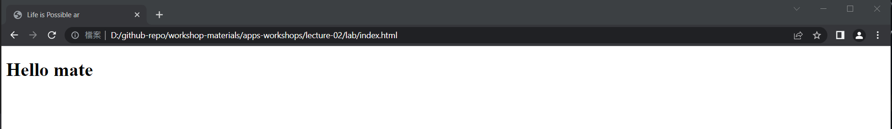

# Life is Possible - 生命教育 手機程式工作坊

Lecture 02 - Introduce to HTML

---

# Menu

- What and Why of HTML
- Concepts of HTML
- Basics HTML structure
- Reading `Tags` and `Docs`

---

# What is HTML and Why


---


---

# How to build those website?

## Python? C++? Ruby? Java?

---

# HTML


---

# HTML (Hyper Text Markup Language)
In brief: 
* HTML is the standard markup language for creating Web pages
* HTML describes the structure of a Web page
* HTML consists of a series of elements
* HTML elements tell the browser how to display the content
* HTML elements label pieces of content such as "this is a heading", "this is a paragraph", "this is a link", etc.

---

# Advantages of HTML

- ✨ Easy to learn.
- 💻 Every browser supports HTML Language. (Cross platform)
- ⚡ HTML is light weighted and fast to load.
- And more ...

---

# Basic structure

`index.html`
```html
<!DOCTYPE html>
<html lang="en">
<head>
    <meta charset="UTF-8">
    <meta http-equiv="X-UA-Compatible" content="IE=edge">
    <meta name="viewport" content="width=device-width, initial-scale=1.0">
    <title>Life is Possible ar</title>
</head>
<body>
    <!-- All stuff here -->
    <h1> Hello mate </h1>
</body>
</html>
```

---

# Minified structure

`index.html`
```html
<!DOCTYPE html>
<html lang="en">
  <head>
      <!-- All Style / CSS / Headerstuff here -->
      <!-- To define meta tags, css file, title is here -->
  </head>
  <body>
      <!-- All HTML / JS stuff here -->
      <!-- To define visible stuff and JS script here -->
  </body>
</html>
```

---

# 🏷 Fundamentals Tags 
Those tags are important to fimilar with

---

# `<html> </html>`
https://developer.mozilla.org/en-US/docs/Web/HTML/Element/html

> The `<html>` HTML element represents the root (top-level element) of an HTML document, so it is also referred to as the root element. All other elements must be descendants of this element.

AKA, to tell the computer that this file is a `HTML` file.

---

# `<head> </head>`
https://developer.mozilla.org/en-US/docs/Web/HTML/Element/head

> The `<head>` HTML element contains machine-readable information (metadata) about the document, like its title, scripts, and style sheets.

AKA, to tell the computer those items are title, scripts, and style sheets.

---

# `<body> </body>`
https://developer.mozilla.org/en-US/docs/Web/HTML/Element/body

> The `<body>` HTML element represents the content of an HTML document. There can be only one `<body>` element in a document.

AKA, to tell the computer those represents the content are between this tag.

---

# Combinded with

`index.html`
```html
<!DOCTYPE html>
<html lang="en">
<head>
    <meta charset="UTF-8">
    <meta http-equiv="X-UA-Compatible" content="IE=edge">
    <meta name="viewport" content="width=device-width, initial-scale=1.0">
    <title>Life is Possible ar</title>
</head>
<body>
    <!-- All stuff here -->
    <h1> Hello mate </h1>
</body>
</html>
```

---
# Output



---

# Notices
1. Several tags are in pairs, but some tags are not.
e.g. (Pair: `<body>...</body>`, Single `<meta>`)
See the documents and tutorials to check the usage.

---

# Break

---

# Basic Tags you need to know

---

# 🏷 Basic Tags in body (Container related)

### `<div>` : Basic Box tag

<hr>

### `<header>` : Store the web header content
### `<section>` : Store content regarding each sections
### `<footer>` : Store the web footer content

---

# Rules 1
### Usually html tags are in paris
```html
   Opening      End
    <div>      </div>
```

```html
<div>some stuff inside the box</div>
<header>some stuff inside the box</header>
<footer>some stuff inside the box</footer>
```

---

# Rules 2
### Tags can nested together, as long as your syntax is correct

```html
<div>

  <div>hello</div>

  <div>
    <div>hello</div>
    <div>yolo</div>
  </div>

</div>
```

---


---


Ref: https://www.interviewbit.com/blog/difference-between-html-and-css/

---

```html
<!DOCTYPE html>
<html lang="en">
<head>
    <meta charset="UTF-8">
    <meta http-equiv="X-UA-Compatible" content="IE=edge">
    <meta name="viewport" content="width=device-width, initial-scale=1.0">
    <title>Hi all</title>
</head>
<body>

    <header>Hello all</header>

    <div>
        <h1>Hello</h1>
    </div>

    <footer>Bye</footer>

</body>
</html>
```

---

# More common tags in body

* `<h1>–<h6>`: Header text tags to contain string.
https://developer.mozilla.org/en-US/docs/Web/HTML/Element/Heading_Elements

* `<p>`: The Paragraph element.
https://developer.mozilla.org/en-US/docs/Web/HTML/Element/p

* `<span>`: Generic inline container.
https://developer.mozilla.org/en-US/docs/Web/HTML/Element/span

* `<br>`: Line Break element.
https://developer.mozilla.org/en-US/docs/Web/HTML/Element/br

* `<b>`: The Bring Attention To element.  
https://developer.mozilla.org/en-US/docs/Web/HTML/Element/b

---

```html
<!DOCTYPE html>
<html lang="en">
<head>
    <meta charset="UTF-8">
    <meta http-equiv="X-UA-Compatible" content="IE=edge">
    <meta name="viewport" content="width=device-width, initial-scale=1.0">
    <title>Hi all</title>
</head>
<body>

    <h1>Hello</h1>
    <h2>Hello 2</h2>
    <h3>Hello 3</h3>

    <br>

    <p>Yoooo</p>
    <span>Apple</span>
    <b>I am strong</b>

</body>
</html>
```

---

# More common tags in body

* ``: The Image Embed element.
https://developer.mozilla.org/en-US/docs/Web/HTML/Element/img

* `<hr>`: The Thematic Break (Horizontal Rule) element.
https://developer.mozilla.org/en-US/docs/Web/HTML/Element/hr

* `<a>`: The Anchor element.
https://developer.mozilla.org/en-US/docs/Web/HTML/Element/a

---

```html
<!DOCTYPE html>
<html lang="en">
<head>
    <meta charset="UTF-8">
    <meta http-equiv="X-UA-Compatible" content="IE=edge">
    <meta name="viewport" content="width=device-width, initial-scale=1.0">
    <title>Hi all</title>
</head>
<body>

  <a href="https://youtu.be/dQw4w9WgXcQ"> Funny youtube video </a>

  <hr>

  

</body>
</html>
```

---

# More common tags in body

* `<ul>`, `<ol>`, `<li>`: unorder list, order list and list item
https://developer.mozilla.org/en-US/docs/Web/HTML/Element/ul
https://developer.mozilla.org/en-US/docs/Web/HTML/Element/ol
https://developer.mozilla.org/en-US/docs/Web/HTML/Element/li

---

# More common tags in body (Functional)
Will be cover more in later JS lessons

* `<button>`
* `<form>`
* `<input>`
* `<option>`

---

# More common tags in body
See here to know what we can use in HTML:
https://developer.mozilla.org/en-US/docs/Web/HTML/Reference

#### ‼ Remember: Searching google and documents is the key to code. ‼

---

# Break and play time

---

# Lab 01 - Try clone me
Try to code the regarding images with `html` code.

<br>

Notes: The `😀` is an emoji.


---

# Lab 02 - Introduce yourself
With the following template, try to intruduce yourself with an html pages. 
(Either English or Chinese is ok)

```html
<!DOCTYPE html>
<html lang="en">
<head>
    <meta charset="UTF-8">
    <meta http-equiv="X-UA-Compatible" content="IE=edge">
    <meta name="viewport" content="width=device-width, initial-scale=1.0">
    <title>Peter homepages</title>
</head>
<body>
  <!-- Your content -->
</body>
</html>
```

--- 

# Lab 02 - Introduce yourself (Cont)
You `SHOULD` contain these items in your intro:

* 📃 Name and a short intro to describe yourself
* 📚 4 Favourite stuff to share, 3 friend name and more... 
* ✏ Proper layout and UI to design the site

You `MAY` contain these items in your intro:

* ✨ More you can think of ...

--- 

# Lab 02 - Introduce yourself (Cont)
After the works, you will have a `30 - 60 seconds` time to present the website to others. Rename the site.html to `<your-name>_l01_lab02.html` e.g. `peter_l01_lab02.html`

You may submit the site to google form in here:
(Link will be share in lecture time)

---

# End

---

# Extra Readings

- w3school HTML Tutorial
https://www.w3schools.com/html/

- How to structure HTML for an actual website
https://zellwk.com/blog/html-structure/