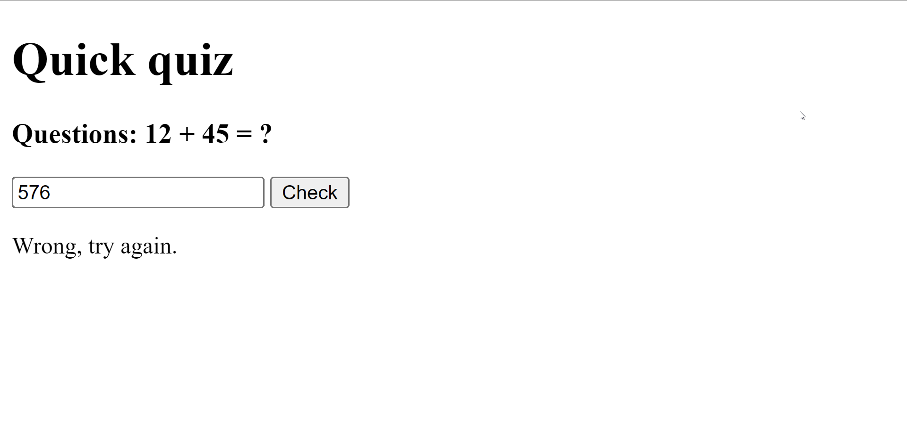
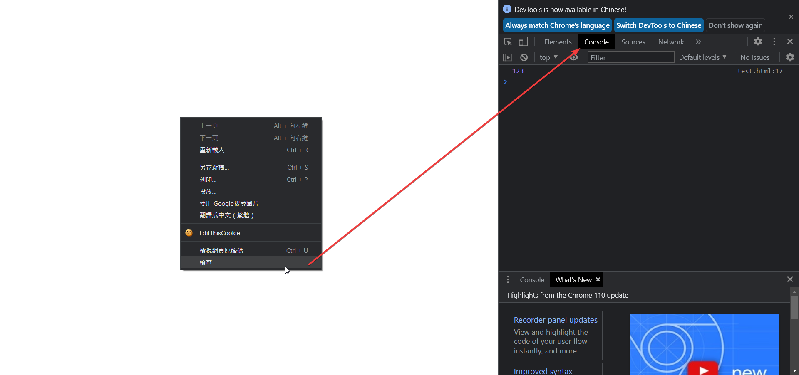

# Life is Possible - 生命教育 手機程式工作坊

講課 05 - 使用 JavaScript 與 HTML 互動

---

# 目錄

- 在 HTML 中使用 JS
- DOM 控制
- 制作一個小小的測驗遊戲

---

## 回顧
我們在之前的課程中學到了什麼？

```js
let a = 10;

if(a === 10){
  console.log("Hello mate")
}

function calculateAgeStatus(age){
    console.log(`You are in ${age} right?`)
}

calculateAgeStatus(16)
```

---

## 回顧總結
 
- 執行 `app.js`
- 用 `console.log` 輸出變量
- 資料型別 `string`, `number`, `boolean`
- 算術運算符 `++`, `*`, `/` 等等
- 賦值運算符 `=`, `+=`, `*=`, `/=` 等等 
- 定義變量 `let`, `const`, `var`
- 條件語句 `if`, `else`
- 比較語句 `==`, `===`, `<=` 等等
- 函數 `function add(a,b){ return a + b }`

---

# 但是
如果 JavaScript 放在 HTML 中呢？

---

# 快速測試
我們有一個 HTML 文件作為快速小測驗，我們該如何知道使用者輸入了正確的答案？



---

# 使用 HTML ?
糟糕了，HTML 只用於定義元素。

# 使用 CSS ?
不行。CSS 只用於樣式。

# 使用 Javascript ?
對，但為什麼？

---

# 我們需要在 HTML 中使用 JavaScript

`JavaScript` 是 HTML 中的大腦，它幫助執行所有計算/邏輯渲染工作。

例如：是否有東西被點擊？計算使用者輸入的總和。

---

# 在 HTML 中加入 `script`

在 HTML 中，我們可以添加 `<script>` 標籤來使用 JavaScript。

```html
<!DOCTYPE html>
<html lang="en">
<head>
    <title>Document</title>
</head>
<body>
    <h1> Yo all </h1>
    <script> <!-- Add me for using script -->
        console.log("Hello all")
    </script>
</body>
</html>
```

---

# 在 HTML 中加入 `script`
```html
<script> 
      let a = 100;
      let b = 23;

      let c = a + b;

      console.log(c); // where is it logged to?
</script>
```

在網頁中按下`右鍵`或按下 `F12` 開啟 `DevTools` ，然後在右上方尋找 `Console`。

---



---

# 使用  `document.querySelector()` 控制網頁元素

---

# Web JS 的基本網頁元素控制

讓我們假設有以下的 HTML：

`index.html`
```html
<!DOCTYPE html>
<html lang="en">
<head>
    <meta charset="UTF-8">
    <meta http-equiv="X-UA-Compatible" content="IE=edge">
    <meta name="viewport" content="width=device-width, initial-scale=1.0">
    <title>Document</title>
</head>
<body>
    <h3 id="msg">Hello mate</h3>
    <h3 class="yolo">yolo hi</h3>
</body>
</html>
```

---

# 取得 DOM 元素

一般來說，我們有以下兩個方法可以取得相對應的元素，兩個方法都是網頁內建的。

```js
// getElementBy
const msgBox = document.getElementById('msg'); // Is a id
const yoloBox = document.getElementsByClassName("yolo"); // Is a array
```

```js
// querySelector
const msgBoxQu = document.querySelector('#msg'); // Is a id
const yoloBoxQu = document.querySelector(".yolo"); // Not a array

// 因為 msg 是一個 id，所以我們需要加上 #
// 因為 yolo 是一個 class，所以我們需要加上 .
```

這些方法可以幫助我們取得相關的元素。


---

# 將互動加入到框框裡
一般來說，我們可以在 DOM 元素中加入事件：

```js
const msgBox = document.getElementById('msg');

// When the msgBox box clicked, a message box will be pop up 
msgBox.addEventListener("click", function() {
    alert("Hello mate")
});
```

---

`index.html with const`
```html
<!DOCTYPE html>
<html lang="en">
<head>
    <meta charset="UTF-8">
    <meta http-equiv="X-UA-Compatible" content="IE=edge">
    <meta name="viewport" content="width=device-width, initial-scale=1.0">
    <title>Document</title>
</head>
<body>
    <h3 id="msg">Hello mate</h3>

    <script>
        const msgBox = document.getElementById('msg');

        // When the msgBox box clicked, a message box will be pop up 
        msgBox.addEventListener("click", function() {
            alert("Hello mate")
        });
    </script>
</body>
</html>
```

---

`index.html with document`
```html
<!DOCTYPE html>
<html lang="en">
<head>
    <meta charset="UTF-8">
    <meta http-equiv="X-UA-Compatible" content="IE=edge">
    <meta name="viewport" content="width=device-width, initial-scale=1.0">
    <title>Document</title>
</head>
<body>
    <h3 id="msg">Hello mate</h3>

    <script>
        // When the msgBox box clicked, a message box will be pop up 
        document.getElementById('msg').addEventListener("click", function() {
            alert("Hello mate")
        });
    </script>
</body>
</html>
```

---
# DOM值控制
您也可以通過 `innerHTML` 控制元素的消息。

---

`index.html with const`
```html
<!DOCTYPE html>
<html lang="en">
<head>
    <meta charset="UTF-8">
    <meta http-equiv="X-UA-Compatible" content="IE=edge">
    <meta name="viewport" content="width=device-width, initial-scale=1.0">
    <title>Document</title>
</head>
<body>
    <h3 id="msg">Hello mate</h3>
    <h3 id="yolo">yolo hi</h3>

    <script>
        const msgBox = document.getElementById('msg');
        const yoloBox = document.getElementById('yolo');

        msgBox.addEventListener("click", function() {
            yoloBox.innerHTML = "hello ar"
        });
    </script>
</body>
</html>
```

---

`index.html with document`
```html
<!DOCTYPE html>
<html lang="en">
<head>
    <meta charset="UTF-8">
    <meta http-equiv="X-UA-Compatible" content="IE=edge">
    <meta name="viewport" content="width=device-width, initial-scale=1.0">
    <title>Document</title>
</head>
<body>
    <h3 id="msg">Hello mate</h3>
    <h3 id="yolo">yolo hi</h3>

    <script>
        document.getElementById('msg').addEventListener("click", function() {
            document.getElementById('yolo').innerHTML = "hello ar"
        });
    </script>
</body>
</html>
```

---

# 更多 `innerHTML` 參考資料

---
`counter.html`
```html
<body>
    <h3 id="counter">0</h3>
    <button id="addCount">add num</button>

    <script>
        const counterNumber = document.getElementById('counter');
        const addCount = document.getElementById('addCount');

        addCount.addEventListener("click", function() {
            let originalNUmber = parseInt(counterNumber.innerHTML)
            originalNUmber ++;

            counterNumber.innerHTML = originalNUmber
        });
    </script>
</body>
```

---

# 休息一下

---

# 控制輸入

在 HTML 中，我們有一個標籤 `<input>`，允許用戶輸入內容。


> HTML 的 `<input>` 元素用於創建交互式控件，以便接受用戶從網頁表單中輸入的數據。

https://developer.mozilla.org/en-US/docs/Web/HTML/Element/input

---

# 用 `<input>` 控制

`<input>` 標籤用於獲取用戶輸入的數據，並將其發送回服務器/本地進行檢查。

例如，我們可以像這樣使用 `<input>` 標籤：

```html
<input id="textInput" type="text">
<input id="numberInput" type="number">
<input 
    type="file" id="fileInput"
    id="avatar" name="avatar"
    accept="image/png, image/jpeg"
>
```

---

# 用 `<input type="???">` 控制

支持以下類型：

- `text`, `number`, `date`
- `password`, `email`
- `checkbox`, `radio`
- `color`, `url`
- `week`, `month`, `time`, `datetime-local`, `date`
- `tel`, `range`
- `submit`, `reset`

以及更多...

---

# 取得 `<input>` 值

在 JavaScript 中要取得 `<input>` 的值，必須先給予它一個 id 或 class。

`index.html`
```html
<input id="textInput" type="text" value="hello">
```

接著，在 JavaScript 中，我們可以使用 `.value` 屬性來取得它的值。

`index.js`
```js
const textInput = document.getElementById("textInput");
console.log(textInput.value);
```

---

# 當使用者輸入時取得 `<input>` 值

為了偵測使用者的輸入事件，我們可以使用 `addEventListener` 與 `input` 事件來聆聽輸入事件。

`index.html`
```html
<input id="textInput" type="text">
```

`index.js`
```js
const textInput = document.getElementById("textInput");

textInput.addEventListener("input", () => {
    console.log(textInput.value)
})
```

---

# 當使用者輸入時取得多個 `<input>` 值

如果要取得多個不同的 `<input>`，必須為每個 `<input>` 元素分別指定不同的 id。

```html
<input id="textInput" type="text">
<input id="englishInput" type="text">
```

`index.js`
```js
const textInput = document.getElementById("textInput");
const englishInput = document.getElementById("englishInput");

textInput.addEventListener("input", () => {
    console.log(textInput.value)
})

englishInput.addEventListener("input", () => {
    console.log(englishInput.value)
})
```

---

# 休息一下

---

# Lab 1: 數學測驗

撰寫一個數學測驗的網站，每次會產生不同的數學題目及答案，並依據使用者輸入來檢查答案是否正確。

範例:
- 這一次的題目是 10 + 23 = ?
- 其他時間的題目是 10 + 36 = ?
- 另一次的題目是 10 + 2 = ?

您可以參考 `quiz.html` 檔案進行實作。

提示 1: 使用 `Math.floor(Math.random() * 30)` 產生一個隨機整數。

---
# Lab 1: 數學測驗提示

`tips1.js`
```js
let rngNum = Math.floor( Math.random() * 30) + 1;
```

`tips2.html`
```html
<h3>Questions: 10 + <p id="rngNumberBox"></p> = ?</h3>
```

---

# Lab 1.1: 加強版數學測驗
如果您已經完成了練習 1，請嘗試調整題目為：

- 問題: 10 + x = 45，找出 x 的值
- 問題: 14 + x = 32，找出 x 的值

製作一個網站，要求使用者輸入 `x`，並檢查 `x` 是否符合方程式。答案也應該是隨機產生的。

---

# 結束