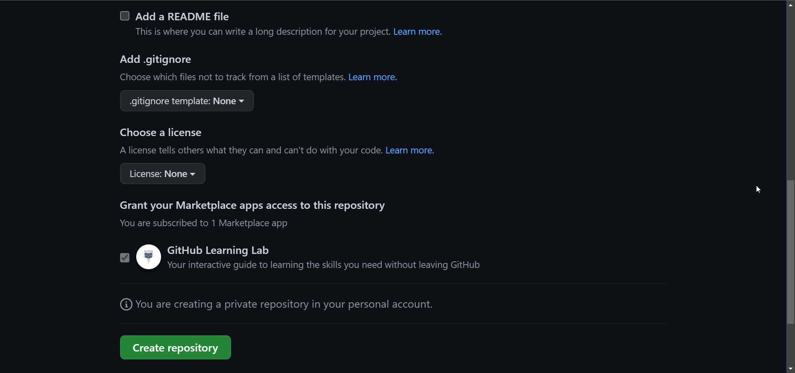
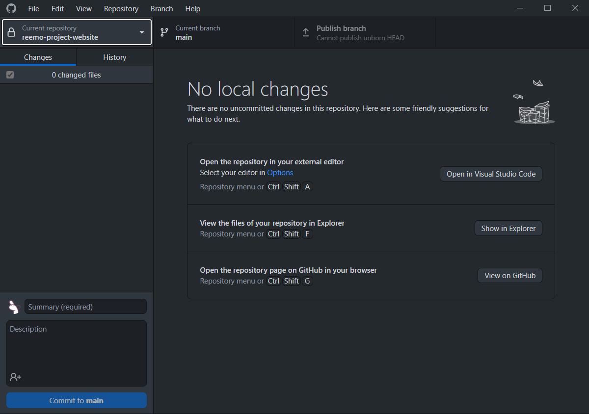
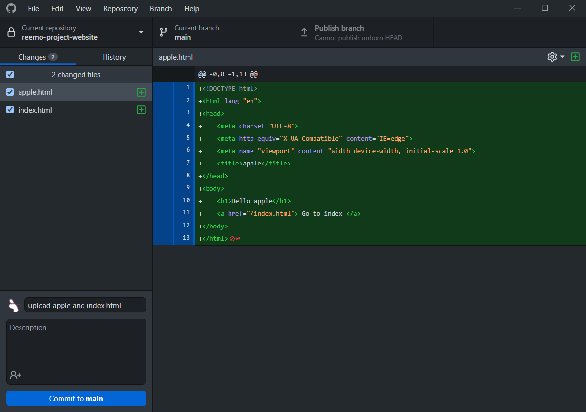
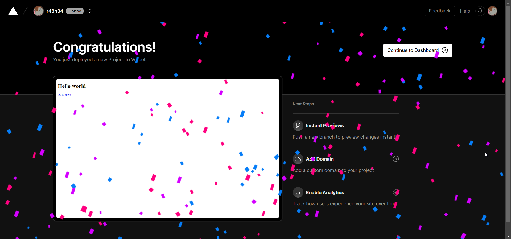
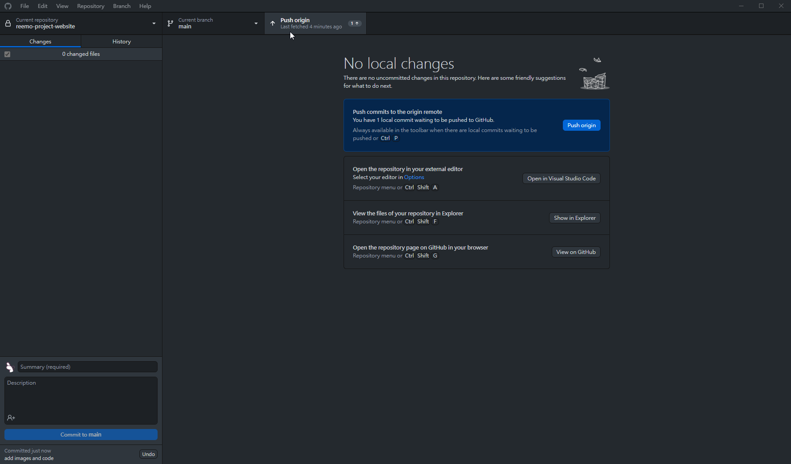
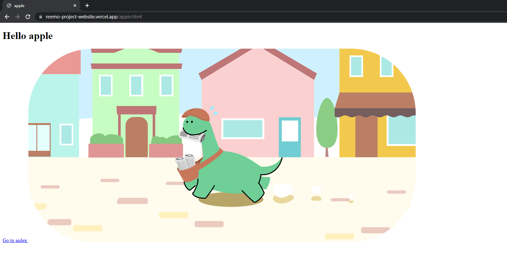

# Life is Possible - 生命教育 手機程式工作坊

講課 06 - 進階- Github、部署、規劃

---

# 目錄

- Github 和 Github Desktop
- 使用Vercel進行部署
- 計畫和結構網站
- 分組和討論


---

# Github 和 Github Desktop
https://github.com/

---

# 什麼是Github？

> GitHub是一個在線軟件開發平台。它用於存儲、跟踪和協作軟件項目。

---

# 什麼是Github？

- 大多數程序員和IT公司使用它
- 用於協作和代碼版本控制
- 你可以把`Github`視為程序員版的 `Google Drive`
- 所有代碼都會使用`git`上傳到`Github`

---

# Lab 01 - 創建Github帳戶
https://github.com/signup?ref_cta=Sign+up&ref_loc=header+logged+out&ref_page=%2F&source=header-home

點擊上面的鏈接先註冊一個帳戶。如果你還沒有電子郵件，現在就註冊一個gmail帳戶。

---

# Github 頁面的內容?


---

# 倉庫 (Repositories)

- 每個項目都被稱為 `repository`（又稱為 repo）
- 我們將創建一個 `repository`，並將所有項目代碼上傳到該 `repository` 中

---

# Lab 02 - 創建一個新的私有倉庫 (Private repository)

按照以下步驟創建一個倉庫：

您應該從 Github 首頁開始，點擊 `右上角的加號 +` 圖標，選擇 `New repository`

---

# Lab 02 - 步驟 1
將倉庫命名為 `<your_name>-project-website`，然後選擇 `Private`


---

# Lab 02 - 步驟 2
向下滾動並取消選中 `Add a README file`，然後點擊 `Create a repository`




---

# Lab 02 - 步驟 3
如果完成，您將看到相應的屏幕。


---

# Lab 03 - 下載 Github 桌面版

https://desktop.github.com/

---

# Lab 03 - 步驟 1
您將看到相應的屏幕，點擊 `Download for XXXX` 按鈕進行下載。


---

# Lab 03 - 步驟 2
下載完成後，點擊 `Sign in with Github.com` 進行登錄。


---

# Lab 03 - 步驟 3
成功登錄後，您可能會看到相應的屏幕（不包含內容）


---

# Github Desktop 是什麼？為什麼要使用？

- 💻 一個基於 GUI 的 git 軟體
- 📡 容易上手的 git 管理 GUI
- 🧰 免費且強大

在初步階段，我們將使用 `Github Desktop` 來 `push`，`clone`，`pull`，`merge` 專案。如果您對編程有興趣，當您熟悉 `Github Desktop` 後，您可以學習 `git`。

---

# Lab 04 - 使用 Github Desktop 來 `push` 代碼

如果您還沒完成`Lab 01-03`，請先完成這些實驗室。

在這個實驗室中，我們將進行以下操作：

1. 克隆(Clone)代碼
2. 在本地電腦上調整代碼
3. 推送代碼到 `Github`

---

# Lab 04 - 步驟 1
回到這個畫面，您可以在畫面中央左側看到一個名為 `Set up in Desktop` 的按鈕。點擊它。


---

# Lab 04 - 步驟 2
點擊後會彈出以下畫面。選擇一個適當的 `本地路徑`，然後點擊藍色的 `Clone` 按鈕。


---

# Lab 04 - 步驟 3
`Clone` 完成後，您會看到這個畫面。檢查左上角的部分是否是您的存儲庫名稱。



---

# Lab 04 - 步驟 4
右鍵點擊左上角的部分，然後選擇 `Open in Visual Stuidio Code` 進入 VSC。


---

# Lab 04 - 步驟 5
在文件夾中創建一個 `index.html` 和 `apple.html`。


---

# Lab 04 - 步驟 6
將這些內容複製到 `index.html`

```html
<!DOCTYPE html>
<html lang="en">
<head>
    <meta charset="UTF-8">
    <meta http-equiv="X-UA-Compatible" content="IE=edge">
    <meta name="viewport" content="width=device-width, initial-scale=1.0">
    <title>index</title>
</head>
<body>
    <h1>Hello world</h1>
    <a href="/apple.html"> Go to apple </a>
</body>
</html>
```

---

# Lab 04 - 步驟 7
將這些內容複製到 `apple.html`

```html
<!DOCTYPE html>
<html lang="en">
<head>
    <meta charset="UTF-8">
    <meta http-equiv="X-UA-Compatible" content="IE=edge">
    <meta name="viewport" content="width=device-width, initial-scale=1.0">
    <title>apple</title>
</head>
<body>
    <h1>Hello apple</h1>
    <a href="/index.html"> Go to index </a>
</body>
</html>
```

---

# Lab 04 - 步驟 8

<div class="columns">

<div>

  1. 回到 Github Desktop，選擇 `index.html` 和 `apple.html`
  2. 在 `Summary (required)` 輸入框中輸入內容
  3. 輸入後，點擊 `Commit to main`

</div>

<div>

  

</div>


</div>


---

# Lab 04 - 步驟 9
現在你可以點擊 `Published branch` 按鈕了。點擊後等待上傳。


---

# Lab 04 - 步驟 10 Done
如果你從 Github 網站重新整理頁面(F5)並看到 `index.html` 和 `apple.html`，表示你成功了。


---

# Lab 04 我們做了什麼？

- `Set up in Desktop` => `git clone` 
克隆一個項目表示下載一個項目
- `Type in Summary (required)` + `Commit to main` => `git commit`
提交表示對代碼庫進行了更改
- `Click Published branch` => `git push`
推送表示將這些更改添加到分支中


---

# 休息一下

---

# 將網站部署到全球

---

# 如何連接網際網路並查看網站？

- 🖥 電腦？
- 🖨 物聯網裝置？
- 📱 手機？
- 📟 設備？
- 💻 伺服器？

---


---

# 💻 伺服器
我們需要一個伺服器來為使用者提供我們的網站/內容。

伺服器將幫助我們為目標用戶提供所需的數據。

---

# 如何獲得伺服器

### 自我託管?
### 雲端託管（SaaS）？

---

# 軟件即服務（SaaS）
>  一種軟件授權和交付模式，其中軟件以訂閱方式許可並集中託管。SaaS也被稱為'按需軟件'和Web-based/Web-hosted軟件

例如：AWS，Azure，GCP，Digital ocean，vercel等...


---

# 使用 `vercel` 進行網站託管

> 網站託管服務是一種互聯網託管服務，為客戶提供託管網站所需的設施，即使其創建和維護網站，並在全球資訊網上進行訪問。提供網站託管服務的公司有時被稱為網站託管服務提供商。

也就是說，您可以從雲端提供商公司租用伺服器。

---

# Lab 05 - 部署 `Github` 儲存庫到 `vercel`

> Vercel 是為前端開發人員打造的平台，提供創新者創造靈感時需要的速度和可靠性。

在這個實驗室中，我們將部署Lab 04 的 `Github` 儲存庫到 `vercel`。（免費）

---

# Lab 05 - 步驟 1
打開 https://vercel.com/ ，並點擊 `sign up`。在該頁面中，點擊 `Continus with GitHub` 並進行註冊。

---

# Lab 05 - 步驟 2
如果您可以看到此頁面，請點擊右上角的 `Add New..`，並選擇 `Project`。


---

# Lab 05 - 步驟 3
選擇您的 repo，點選 `import`。
注意: 如果您尚未在 `vercel` 中授權 github，請先授權。


---

# Lab 05 - 步驟 4
在此頁面，只需點擊 `Deploy`，等待部署完成即可。


---

# Lab 05 - 步驟 5
恭喜，您已經成功將網站部署到全球！
點擊 `Continus to Dashboard` 並獲取 `DOMAINS` 網址。




---

# Lab 05 - 步驟 6
一個隨機的 `DOMAINS` 將被指定給您。這是您的網站所屬的網址。您可以將鏈接分享給他人。請嘗試單擊它並將鏈接分享給他人。


---

# Lab 05 - 步驟 7 
回到具有您的專案的 VSC。
現在，嘗試向我們的 `index.html` 添加更多代碼。

添加任何您喜歡的內容，甚至可以打開新頁面。

---

# Lab 05 - 步驟 8 
打開一個名為 `images` 的 `folder`，並添加一個圖像。

在 `apple.html` 中，在 `<body>` 中添加 `` 標記，並參照圖像

`apple.html` 樣本
```html

```

---

# Lab 05 - 步驟 8 (Cont)
`samples`


---

# Lab 05 - 步驟 9 

回到 Github Desktop，執行與 Lab 04 - 步驟 8 相同的操作

1. 在左下角輸入提交消息
2. 點擊 `Commit to main`
3. 點擊右上方的 `Push origin`

---

# Lab 05 - 步驟 9 (Cont)



---

# Lab 05 - 步驟 10 Done
返回 `vercel` 並打開專案，您將看到網站已更新。



---

# Lab 05 重點：Vercal 和 Github repo
每當發生推送時，`vercel` 將知道您的專案已更新並使用最新版本重新部署。

✨ 實際上，`vercel` 將使用 `Github Actions` 自動進行 `CI / CD` 進行部署。

---

# 休息一下?

---

# 分組和討論

---

# 專案講解安排

每組由2至4名學生組成，並於接下來的三週進行專案開發。開發完成後，PWA應部署至Vercel以供公眾使用。

---

# 專案講解安排

- **組員**: 自由分組，每組由2至4名學生組成
- **時限**: 三週（主要在講堂上 => 共6小時）
- **演示**: 第10週
- **主題**: `生命教育` / `珍惜生命` / `其他`，請選擇其中一個主題

---

1. 每人至少完成2頁內容
（2人組 => 4頁，3人組 => 6頁）

2. PWA必須有`index.html`作為首頁，其他頁面則包含其餘內容。

3. 設計網頁時，需考慮大多數使用者使用`iphone`、`android phone`和`ipad`。

4. 學生應在同一個版本庫上工作，而不是每個學生都有自己的版本庫。

---

5. 學生在編寫程式前應該先規劃網站的結構、主題、頁面、功能和風格。

6. `移動響應式`不是必須的，但最好具備以提高使用者體驗和使用者介面的品質。

7. 每個小組應在 `Vercel` 上部署 `PWA`，以供公眾訪問。

8. 小組需要確保部署的 `PWA` 如預期運行正常 (`有效的連結`、`可運行的功能`、`沒有無效的圖片` 和 `href` 等)。

9. 導師/助教可以協助將應用程式/網頁部署到 `Google Play 商店`。

---

# 概述要學習的技能 

### PWA 技能
- `HTML5`, `CSS`, `Javascript`

### 部署/管理技能
- `Github` / `Guthub Desktop` (管理)
- `Vercel` (部署)

### 軟實力
- `溝通` & `團隊合作`
- `批判性思考` & `邏輯思考`
---

# 評分列表

由導師和 TA 團隊評分
總分 100 分 + 10% 獎勵分數 (最高 100 分)

1. 內容 (25%)
2. 創意 / 設計 (25%)
3. 團隊合作和溝通 (25%)
4. 技術技能 (15%)
5. 演示 - Presentations (10%)
6. 獎勵分數 (10% 獎勵, 最高 10%)

---

## 1. 內容 (25%)
- 優秀的想法和主題 (10% - 0%)
- 與內容相關的有趣 / 互動性強的內容 (15% - 0%)

## 2. 創意 / 設計 (25%)
- 優秀的 UI 佈局 / 創意 (10% - 0%)
- 優秀的 UX 設計 (10% - 0%)
- 正確使用圖片 / 視頻 / gif / 圖示 (5% - 0%)

---

## 3. 團隊合作和溝通 (25%)
- 每人至少完成 2 頁 (5%)
- 整個團隊完成項目 (10% - 0%)
- 優秀的團隊氛圍 (10% - 0%)

## 4. 技術技能 (15%)
- 在項目中使用 Github and Github desktop / git (5% / 0%)
- 在項目中使用 Vercel 部署項目 (5% / 0%)
- 在項目中使用 javascript / html / CSS (5% / 0%)

---

## 5. 演示 - Presentations (10%)
- 所有團隊成員展示相關頁面 (5%)
- 優秀的演示表現 (5% - 0%)

## 6. 獎勵 (10% 獎勵，最高 10%)
- 在項目中使用講義未涵蓋的技術 (例如 `AOC`、`animate.css`、`sweetAlert2`...) (0 - 10%)
- 在項目中採用其他框架 (0 - 10%)

---

# 成品演示

有關更多信息，請參見 `project/demo-project/README.md`。


---

# 結束