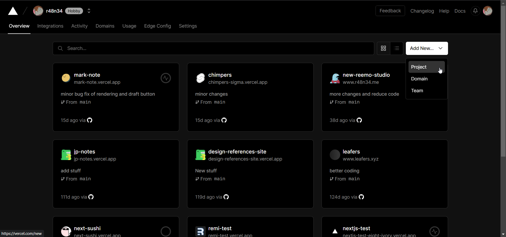

# Life is Possible - 生命教育 手機程式工作坊

Lecture 06 - Adv topic - Github, Deployment and Planning

---

# Menu

- Github and Github Desktop
- Deployment with vercel
- Planning and structure a website
- Grouping and discussions

---

# Github and Github Desktop
https://github.com/

---

# What is Github?

> GitHub is an online software development platform. It's used for storing, tracking, and collaborating on software projects.

---

# What is Github?

- Majority of programmers and IT firm use it
- For collaborating and code version control
- You can assume Github is the programmer version `Google Drive`
- All codes will be upload to github with `git`

---

# Lab 01 - Create Github account
https://github.com/signup?ref_cta=Sign+up&ref_loc=header+logged+out&ref_page=%2F&source=header-home

Following the link to register a account first. If you do not have a email, register a gmail now.

---

# What's inside Github page?


---

# Repositories

- Each project is named `repository` (AKA `repo`)
- We will create a `repository` and upload all project codes in the `repository`

---

# Lab 02 - Create a new Private repository

Follow the steps to create a repository:

You should start on the Github home pages and click the `top right plus +` icons, select `New repository`

---

# Lab 02 - Step 1
Name the repo to `<your_name>-project-website` and select `Private`


---

# Lab 02 - Step 2
Scroll down and un-tick the `Add a README file`, then click `Create a repository`


---

# Lab 02 - Step 3
If you are done, you will see the regarding screen.


---

# Lab 03 - Download the Github desktop

https://desktop.github.com/

---

# Lab 03 - Step 1
You will see the regarding screen, click the `Download for XXXX` button to process the download.


---

# Lab 03 - Step 2
After downloaded, click `Sign in with Github.com` to login


---

# Lab 03 - Step 3
Upon a success login, you may see the regarding screen (without the content)


---

# What / Why is Github desktop?

- 💻 A GUI base git software 
- 📡 Easy git management GUI to learn 
- 🧰 Free and powerful

In early stages, we will use the `Github desktop` to `push`, `clone` , `pull`, `merge` the project.
After you have fimilar with `Github desktop`, you may learn `git` in the future if you are interested in coding.

---

# Lab 04 - Use Github desktop to push the code.

If you not not done the `lab 01-03` yet, please finish those lab first.

We will process the following things in this lab:
1. Clone the code
2. Adjust code in local PC
3. Push the code to github

---

# Lab 04 - Step 1
Back to this screen, you may see a button of `Set up in Desktop` in middle left of the screen. Click it.


---

# Lab 04 - Step 2
This screen will pop up after you clicked. Select a proper `Local path` and click the Blue `Clone` button.


---

# Lab 04 - Step 3
You will be in this screen after the `Clone`. Check if the top left section is your repo name or not.


---

# Lab 04 - Step 4
`Right click` the top left section and select `Open in Visual Stuidio Code` to enter the vsc.


---

# Lab 04 - Step 5
Create a `index.html` and `apple.html` in the folder first.


---

# Lab 04 - Step 6
Copy these content to `index.html`

```html
<!DOCTYPE html>
<html lang="en">
<head>
    <meta charset="UTF-8">
    <meta http-equiv="X-UA-Compatible" content="IE=edge">
    <meta name="viewport" content="width=device-width, initial-scale=1.0">
    <title>index</title>
</head>
<body>
    <h1>Hello world</h1>
    <a href="/apple.html"> Go to apple </a>
</body>
</html>
```

---

# Lab 04 - Step 7
Copy these content to `apple.html`

```html
<!DOCTYPE html>
<html lang="en">
<head>
    <meta charset="UTF-8">
    <meta http-equiv="X-UA-Compatible" content="IE=edge">
    <meta name="viewport" content="width=device-width, initial-scale=1.0">
    <title>apple</title>
</head>
<body>
    <h1>Hello apple</h1>
    <a href="/index.html"> Go to index </a>
</body>
</html>
```

---

# Lab 04 - Step 8

<div class="columns">

<div>

  1. Back to github desktop, select both `index.html` and `apple.html`
  2. type something in `Summary (required)` input box.
  3. After typing, click `Commit to main`

</div>

<div>

  

</div>


</div>


---

# Lab 04 - Step 9
You can click the `Published branch` button now. Click and wait for upload.


---

# Lab 04 - Step 10 Done
If you refresh the pages from the github website and see both `index.html` and `apple.html`, means you are success.


---

# Lab 04 what have we done? 

- `Set up in Desktop` => `git clone` 
Clone a project means download a project
- `Type in Summary (required)` + `Commit to main` => `git commit`
Commit means having changes to the code base
- `Click Published branch` => `git push`
Push mean add those changes to the branch


---

# Break

---

# Deploy the website to the world

---

# How can we access to the internet and see website?

- 🖥 Computer?
- 🖨 IoT devices?
- 📱 Phones?
- 📟 Devices?
- 💻 Server?

---


---

# 💻 Server 
We need a server for users to get our website / content.

Server will help us to serve the target user regarding their desire data.

---

# How can we obtain a server

### Self hosting ?
### Cloud hosting (SaaS) ?

---

# Software as a Service (SaaS)
>  Is a software licensing and delivery model in which software is licensed on a subscription basis and is centrally hosted. SaaS is also known as "on-demand software" and Web-based/Web-hosted software

Examples: AWS, Azure, GCP, Digital ocean, vercel and more...

---

# Web hosting with `vercel`
> A web hosting service is a type of Internet hosting service that hosts websites for clients, i.e. it offers the facilities required for them to create and maintain a site and makes it accessible on the World Wide Web. Companies providing web hosting services are sometimes called web hosts.

AKA You can rent a server from cloud provider company.

---

# Lab 05 - Deploy our Github repo to `vercel`

> Vercel is the platform for frontend developers, providing the speed and reliability innovators need to create at the moment of inspiration.

In this lab, we will deploy the lab 04 Github repo to `vercel`. (Free)

---

# Lab 05 - Step 1
Open https://vercel.com/ and click `sign up`. In that pages, click `Continus with GitHub` and process the register.

---

# Lab 05 - Step 2
If you cna see this page, click top right `Add New..` and select `Project`.



---

# Lab 05 - Step 3
Select your repo to click `import`.
Notices: If you have not grant access to github in `vercel`, grant the access first.


---

# Lab 05 - Step 4
In this page, just click `Deploy` and wait for the deployment happens.


---

# Lab 05 - Step 5
Congratulations, you are success to deploy the website to the world! 
Click `Continus to Dashboard` and obtain the `DOMAINS` url.


---

# Lab 05 - Step 6
A random `DOMAINS` will be assign to you. And this is the url that your website belongs to. You can share the link to others. Try to click it and share the link to others. 


---

# Lab 05 - Step 7 
Back to your VSC with your project.
Now, try to add more code to our `index.html`

Add whatever you like, even open a new page is ok

---

# Lab 05 - Step 8 
Open a `folder` call `images` and add a image to it.

In  `apple.html`, add a `` tag inside `<body>` and references the images


`apple.html` samples
```html

```

---

# Lab 05 - Step 8 (Cont)
`samples`


---

# Lab 05 - Step 9 

Back to `Github Desktop`, do the same things as `Lab 04 - Step 8`

1. Type commit message in bottom left
2. Click `Commit to main`
3. Click `Push origin` in middle top 

---

# Lab 05 - Step 9 (Cont)


---

# Lab 05 - Step 10 Done
Back to the `vercel` and open the project, you will see the website is updated.


---

# Lab 05 Focus: Vercal and Github repo
Whenever a push occur, vercel will know that your project is updated and re-deploy with the latest version.

✨ In dept, vercel will apply the auto `CI / CD` with `Github Actions` for the deployment. 

---

# Break?

---

# Last but not least - Grouping and planning

---

# Project 

2 to 4 student will be in a group, and the following 3 weeks will be the project period. A PWA will be developed and deploy to Vercel for publics to access.

---

# Project details:

- **Group members**: 2 to 4 student Free grouping
- **Period**: 3 weeks (Mostly in lecture time)
- **Present**: Week 10
- **Topics**: `生命教育` / `珍惜生命` / `其他` Choose one


---

# Project details:

1. Each person should done at least 2 pages
(2 ppl group = > 4 pages)
(3 ppl group = > 6 pages)

2. The PWA must have a `index.html` for home pages and others pages for the remaining content.

3. For the PWA, you should design the web that assume most users are using `iphone` , `android phone` and `ipad`.

---


4. Student should **work on the same repository** instead of each student have their own repository.

5. Student should plan the website structure, theme, page, features and style before codings.

6. `Mobile responsive` is not a must but better have it for the sake of user experiences and UI.

---

7. Each group should be deploy the PWA in `vercel`

8. Gropus should ensure the deployed PWA works as expected (`Valid links`, `workable functions`, `no dead images and href` ect...)

---

# Overview skills to use

## PWA skills
- HTML5
- CSS
- Javascript

## Deployment / management skills
- Github / Guthub Desktop (Management)
- Vercel (Deployment)

---

# Project details Planning:
Here are some tips for your planning:

1. Determine the `Project topic` first
2. Then think about the `features` (what we need in our PWA)
3. Consider the style and theme
4. Determine what `pages` to have and WHO work on it
5. Open a Github repository and invite all groupmates.
6. Open those blank `pages` / `folder` / `file` first and have a git push.
7. Other groupmates `git pull` the file and start working.

---

# Project Group

Submit your group List to: TBD
Each group are require to submit it by one person only.

---

# End